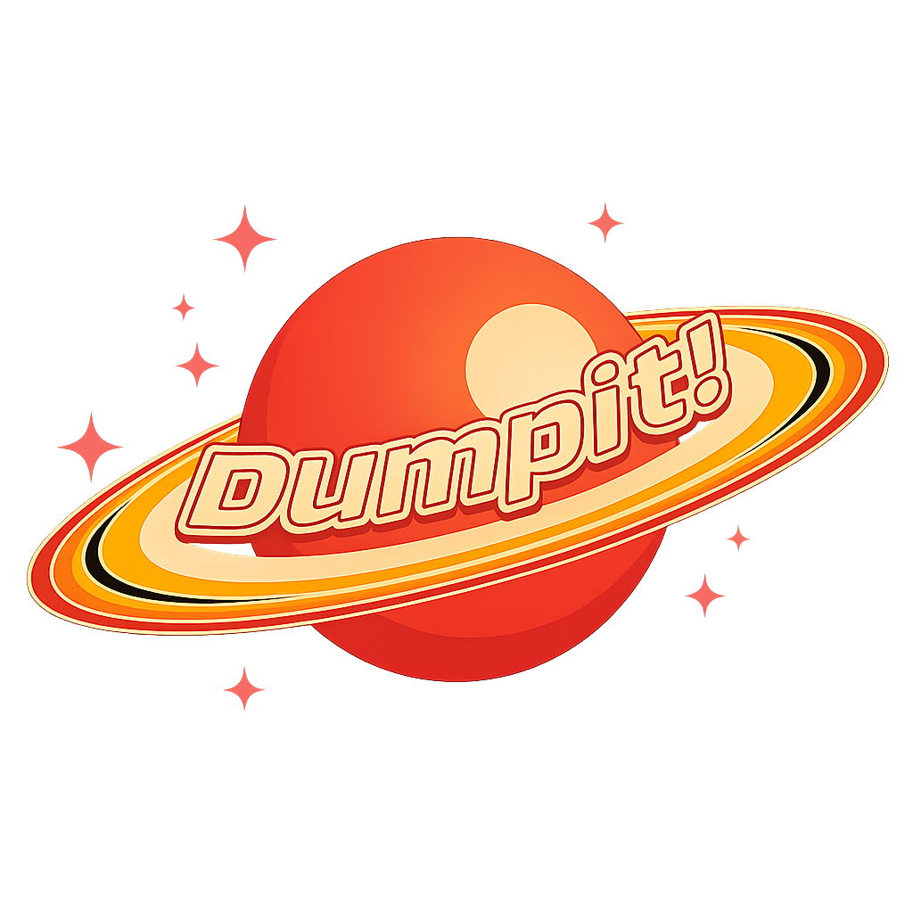
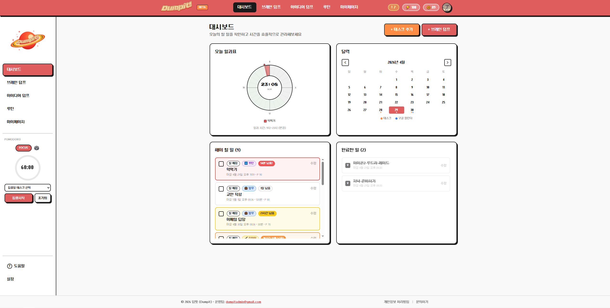
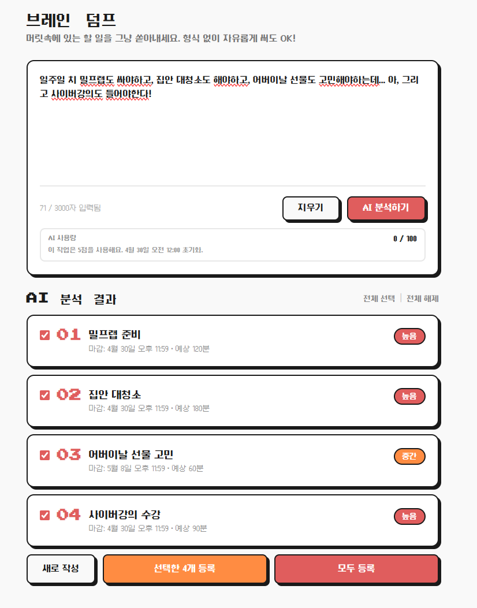
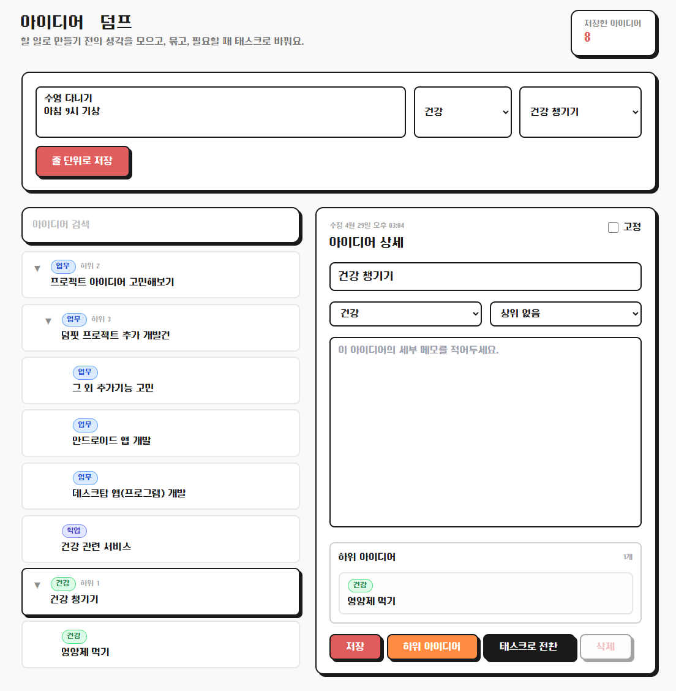
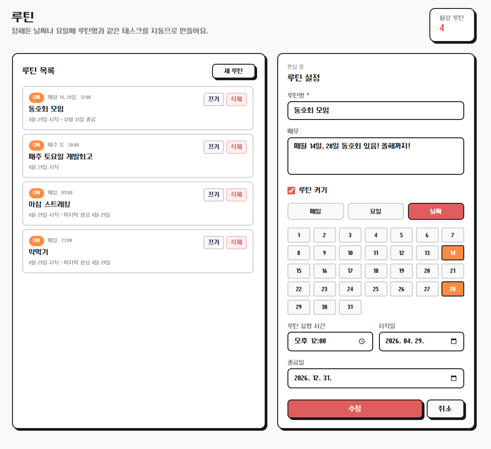
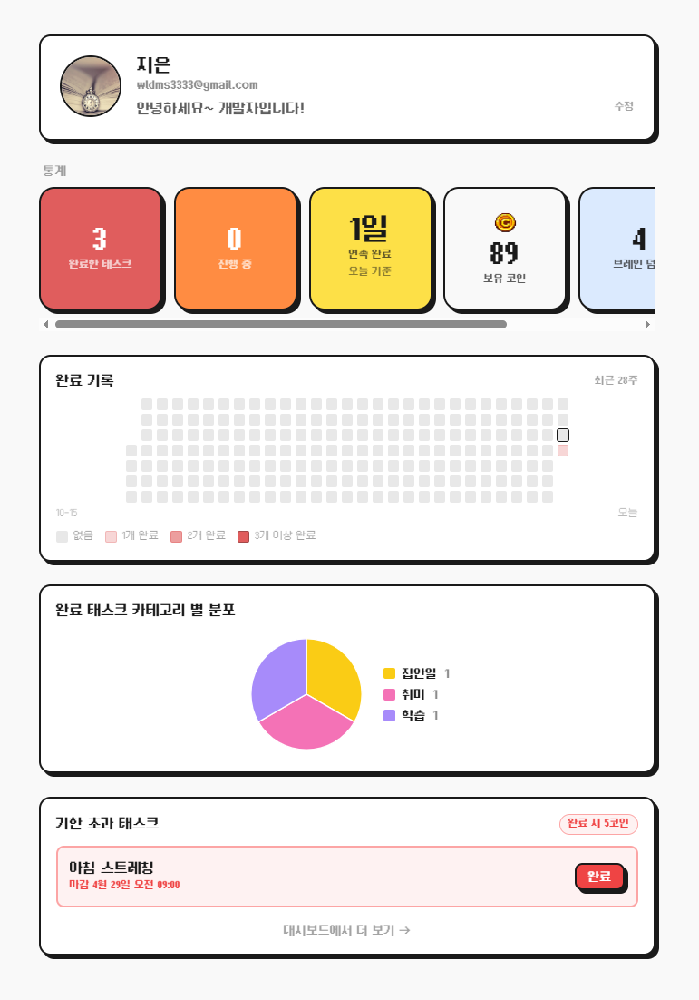

# Dumpit! : 우주먼지처럼 복잡한 일정과 생각을 정리해요




<Dumpit!> 은 머릿속에 흩어진 할 일, 아이디어, 루틴을 빠르게 정리하고 실행 가능한 태스크로 관리하는 생산성 웹앱입니다. 데스크탑 및 노트북 인터넷 환경에 최적화되어 있습니다.

&nbsp;

## 주요 기능

&nbsp;

### 대시보드
▶ 마감일, 예상 소요 시간, 카테고리, 우선순위를 설정할 수 있습니다.<br>
▶ 완료 시 코인을 획득할 수 있습니다.<br>
▶ 마감 임박 태스크 알림을 제공합니다.<br><br>



<br>

### 브레인 덤프
▶ 자유롭게 입력한 생각을 AI가 여러 개의 태스크 후보로 정리합니다.<br>
▶ 선택한 태스크를 할 일에 등록할 수 있습니다.<br><br>



<br>

### 아이디어 덤프
▶ 아이디어를 저장하고 부모/자식 관계로 연결할 수 있습니다. <br>
▶ 트리 형태로 아이디어를 접고 펼쳐 볼 수 있습니다.<br>
▶ 아이디어를 태스크로 전환할 수 있습니다. <br><br>



<br>

### 루틴 관리
▶ 반복적으로 해야 하는 일을 루틴으로 등록할 수 있습니다.<br>
▶ 날짜, 요일, 월 반복 조건을 설정할 수 있습니다.<br>
▶ 실행 가능한 루틴은 자동으로 오늘의 태스크에 추가됩니다.<br><br>



<br>

### 마이페이지
▶ 완료 태스크, 진행 중 태스크, 보유 코인 등 개인 통계를 확인할 수 있습니다.<br>
▶ 최근 28주 완료 기록을 히트맵으로 확인할 수 있습니다.<br>
▶ 기한이 지났지만 완료하지 못한 태스크를 따로 확인하고 완료 처리할 수 있습니다.<br><br>



<br>

&nbsp;

## 기술 스택
  
### Backend

<span>


</span>

### Frontend

<span>


</span>

### Database & Cache

<span>


</span>

### Infra & CI/CD

<span>


</span>

### AI & External Services

<span>


</span>

### Monitoring

<span>

</span>

### Development Environment & Tools

<span>


</span>

> Claude와 Codex는 코드 작성, 구조 설계, 리팩토링 보조 등 개발 과정에서 활용했습니다.

&nbsp;

## 아키텍처

```text
사용자 브라우저
  |
  | React / Vite
  v
프론트엔드
  |
  | REST API / OAuth2 세션
  v
Spring Boot 백엔드
  |-- PostgreSQL: 사용자, 태스크, 아이디어, 루틴, 브레인덤프, 문의 데이터 저장
  |-- Redis: AI 사용량 제한, 마감 임박 알림 보조 데이터 관리
  |-- OpenAI API: 브레인덤프 분석, 태스크 우선순위 판단
  |-- Google OAuth2 / Calendar: 로그인 및 캘린더 연동
  |-- Resend: 문의 알림 메일 발송
  |-- Sentry: 프론트엔드/백엔드 에러 모니터링
```

### 백엔드 계층 구조

```text
controller  -> HTTP API 요청과 응답 처리
service     -> 핵심 비즈니스 로직 및 외부 API 연동
repository  -> JPA 기반 데이터 조회 및 저장
entity      -> 데이터베이스 테이블 매핑
dto         -> 요청/응답 데이터 전달 객체
config      -> 보안, Redis, CORS, 예외 처리 설정
```

### 주요 처리 흐름

```text
브레인 덤프 입력
  -> 백엔드 입력값 검증
  -> AI 사용량 차감
  -> OpenAI 분석 요청
  -> 태스크 후보 생성
  -> 사용자가 확정한 태스크 저장
```

```text
루틴 생성/수정
  -> 반복 조건 저장
  -> 오늘 실행 가능한 루틴이면 즉시 태스크 생성
  -> 자정 이후 스케줄러가 활성 루틴 확인
  -> routine_id + routine_scheduled_date 제약으로 중복 생성 방지
```

```text
마이페이지 조회
  -> 프로필 정보 조회
  -> 태스크 통계 및 완료 히트맵 조회
  -> 기한 지난 미완료 태스크 조회
  -> 프론트엔드에서 카드, 차트, 히트맵으로 표시
```

&nbsp;

## 프로젝트 구조

```text
dumpit/
  backend/
    src/main/java/com/dumpit/
      config/          # 보안, Redis, CORS, 전역 예외 처리 설정
      controller/      # REST API 컨트롤러
      dto/             # 요청/응답 DTO
      entity/          # JPA 엔티티
      repository/      # Spring Data JPA 레포지토리
      service/         # 서비스 인터페이스
      service/impl/    # 서비스 구현체 및 비즈니스 로직
      DumpitApplication.java
    src/main/resources/
      application.yml  # Spring Boot 기본 설정
    build.gradle       # 백엔드 빌드 및 의존성 설정
    Dockerfile         # 백엔드 Docker 이미지 설정

  frontend/
    src/
      assets/          # 이미지 및 정적 리소스
      components/      # 공통 UI 컴포넌트
      components/layout/ # 헤더, 사이드바, 푸터 등 레이아웃 컴포넌트
      constants/       # 공통 상수
      context/         # 인증 등 전역 Context
      hooks/           # 커스텀 훅
      pages/           # 라우트 단위 페이지
      services/        # Axios API 클라이언트
      App.jsx          # 라우팅 및 앱 진입 구조
      main.jsx         # React 앱 마운트 진입점
      sentry.js        # 프론트엔드 Sentry 설정
    package.json       # 프론트엔드 스크립트 및 의존성 설정

  .github/workflows/
    ci.yml             # 백엔드/프론트엔드 빌드 검증
    deploy.yml         # main 브랜치 EC2 배포 자동화

  docker-compose.yml   # 백엔드와 Redis 실행 구성
  .env.example         # 환경 변수 예시
  README.md            # 프로젝트 문서
```
