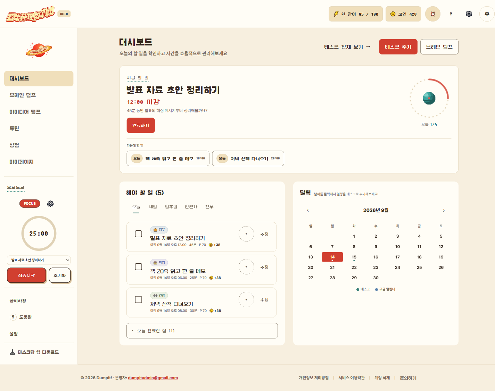
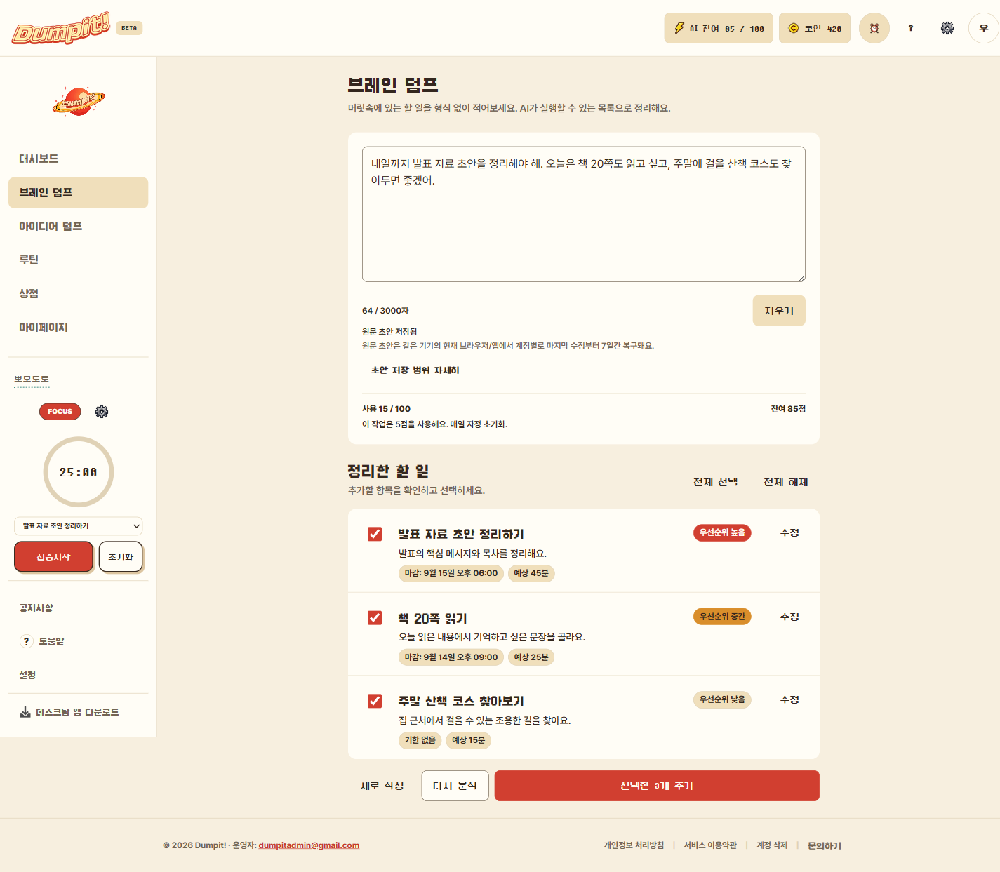
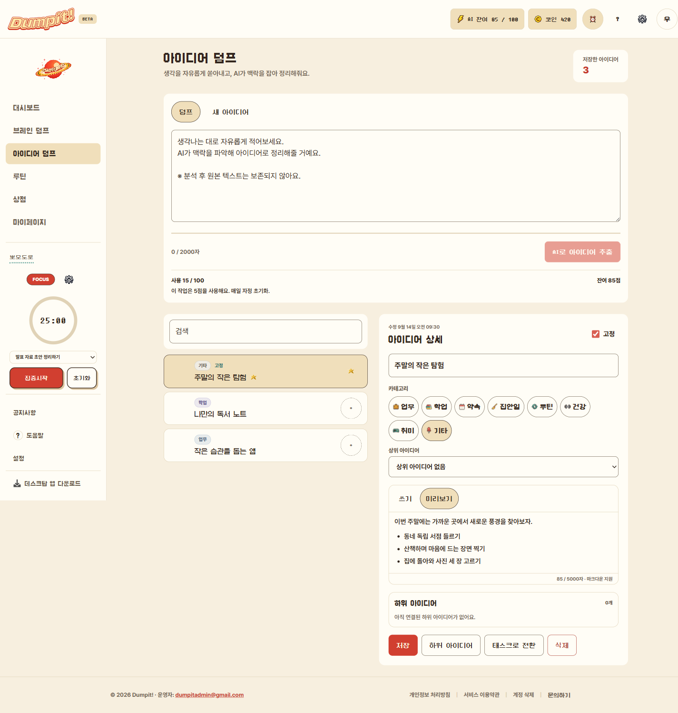
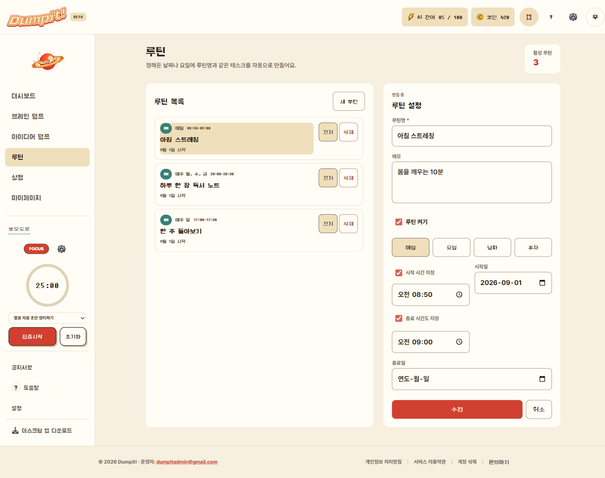
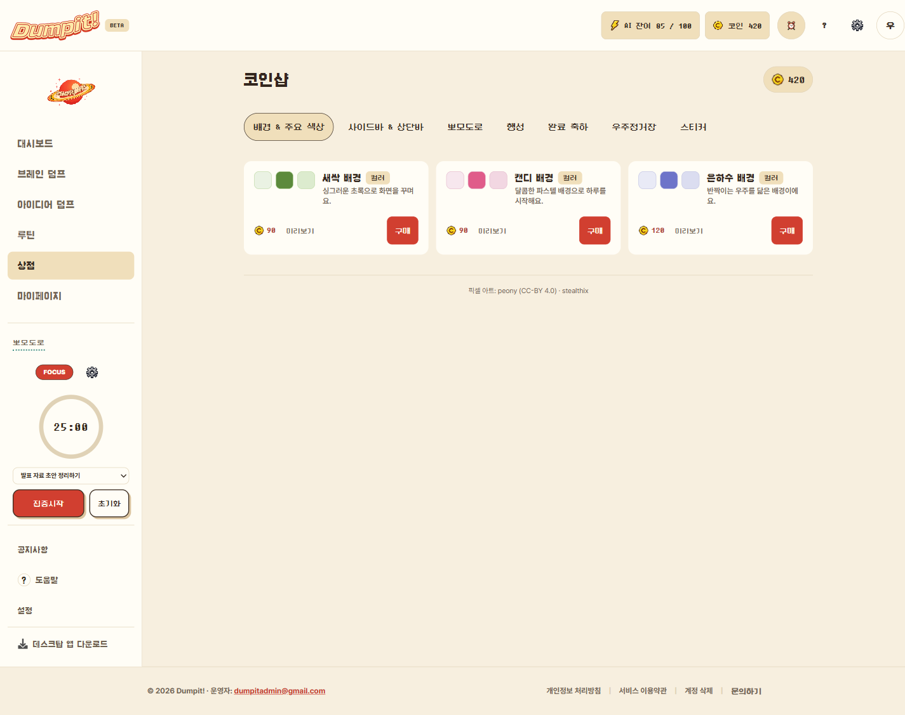
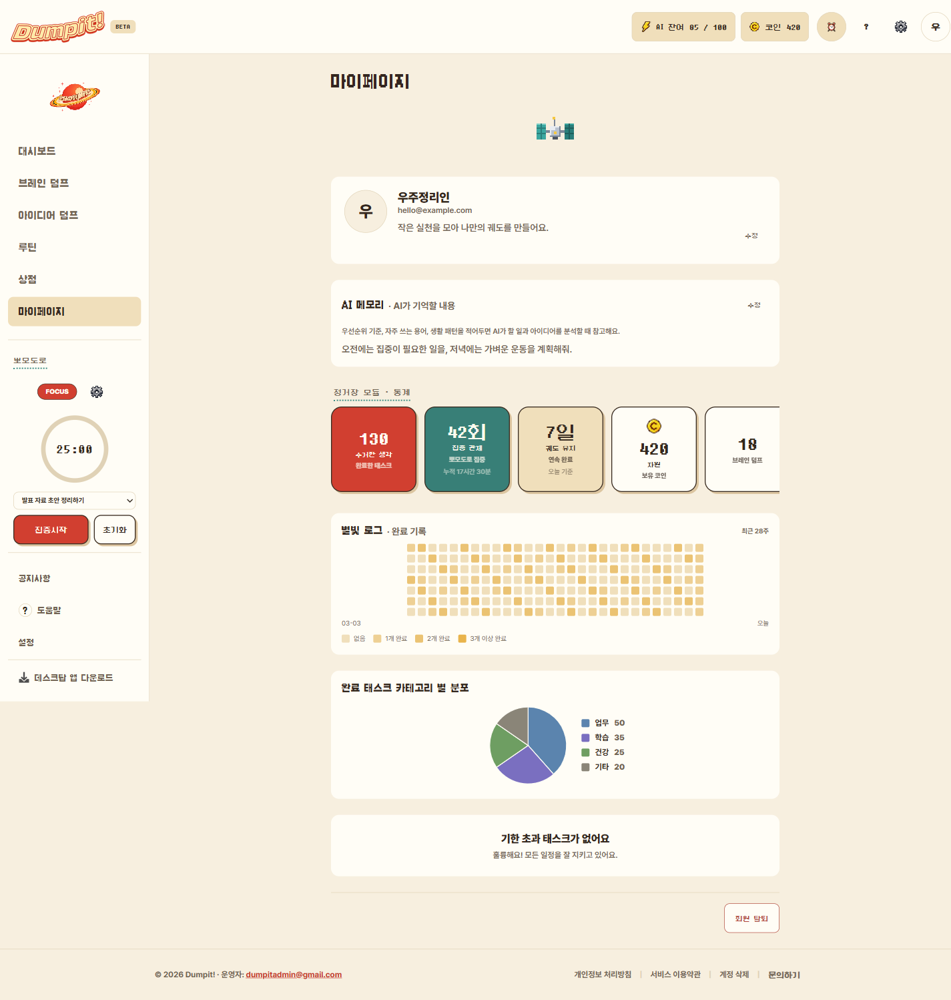
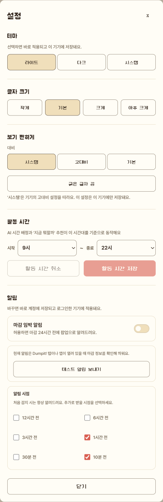
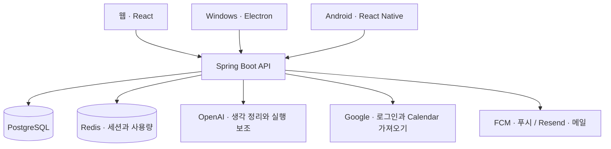

# Dumpit! · 머릿속은 가볍게, 오늘 할 일은 하나씩


덤핏은 흩어진 할 일과 아이디어를 정리하고, 작은 실천으로 이어가도록 돕는 생산성 서비스입니다. 생각을 자유롭게 쏟아내면 AI가 실행할 목록으로 정리합니다. 레트로 우주를 배경으로 할 일, 루틴, 집중 시간과 성취를 한곳에서 관리하세요.

**[웹에서 시작하기](https://dumpit.kr)** · **[Windows 앱 다운로드](https://github.com/doh3e/dumpit/releases/latest)** · **[데스크톱 개발 안내](./desktop/README.md)** · **[Android 개발 안내](./mobile/README.md)**

| 클라이언트 | 구성 |
|---|---|
| 웹 | React 기반 반응형 웹 앱 |
| Windows | 웹 화면을 포함하는 Electron 앱 · 트레이, 자동 시작, 자동 업데이트, 뽀모도로 위젯 |
| Android | React Native·Expo 기반 네이티브 앱 · Google 로그인, 푸시 알림, 홈 화면 위젯 |

세 클라이언트는 같은 백엔드를 사용합니다. 할 일과 계정 설정은 서버에서 관리하며, 테마·글자 크기·고대비·굵은 글자 설정은 기기별로 저장합니다.

## 화면과 주요 기능

아래 화면은 **2026년 9월 14일 기준 웹 UI**를 로컬에서 실행해 캡처했습니다. 계정·할 일·AI 결과·통계·코인샵 상품은 설명을 위한 예시 데이터입니다.

### 지금 할 일부터 시작하는 대시보드

지금 할 일과 다음 순서를 확인하고, 오늘·내일·일주일·언젠가·전체 목록으로 할 일을 살펴봅니다. 마감, 예상 시간, 카테고리와 우선순위를 관리하며 달력에서 일정도 확인할 수 있습니다.



| 기능 | 할 수 있는 일 |
|---|---|
| 브레인 덤프 | 자유롭게 쓴 생각을 AI가 할 일 후보로 정리하고, 필요한 항목을 선택·편집해 등록 |
| 아이디어 덤프 | AI로 아이디어 추출, 직접 기록, 상·하위 아이디어 연결, 마크다운 미리보기, 태스크 전환 |
| 루틴 | 매일·요일·날짜·주차 반복 조건으로 할 일을 자동 생성 |
| 뽀모도로 | 할 일과 연결한 집중·휴식 타이머, 세트와 긴 휴식 설정, 집중 기록 |
| 코인샵 | 할 일 완료와 유효한 집중 기록으로 모은 코인으로 테마·스티커·꾸미기 아이템 구매 |
| 마이페이지 | 완료 기록, 연속 완료 일수, 집중 시간, 카테고리별 통계와 AI 메모리 관리 |
| 보기 편하게 | 라이트·다크·시스템 테마, 글자 크기, 고대비·굵은 글자 설정과 키보드 조작 |

<details>
<summary><strong>브레인 덤프 · 생각을 할 일로 바꾸기</strong></summary>

최대 3,000자의 원문을 입력하면 AI가 제목·설명·마감·예상 시간을 가진 후보로 정리합니다. 등록 전에 각 후보를 수정하거나 선택에서 제외할 수 있습니다.

원문 초안은 같은 기기의 브라우저/앱에서 계정별로 마지막 수정 후 7일 동안 복구됩니다. AI 분석 결과는 초안 복구 대상에 포함되지 않습니다.



</details>

<details>
<summary><strong>아이디어 덤프 · 떠오른 생각을 연결하기</strong></summary>

아이디어를 자유롭게 적거나 AI로 정리하고, 검색·고정·상하위 연결로 모아둡니다. 마크다운으로 내용을 정리한 뒤 실행할 아이디어는 태스크로 전환할 수 있습니다.



</details>

<details>
<summary><strong>루틴 · 반복할 일을 미리 정하기</strong></summary>

반복 조건과 시작·종료일을 설정하면 해당 날짜에 할 일이 생성됩니다. 루틴을 잠시 끄거나, 기존 루틴의 시간과 메모를 수정할 수 있습니다.



</details>

<details>
<summary><strong>코인샵 · 나만의 우주 꾸미기</strong></summary>

배경, 행성, 뽀모도로, 정거장, 완료 효과와 스티커를 둘러보고 미리보기·구매·장착할 수 있습니다.



</details>

<details>
<summary><strong>마이페이지 · 쌓인 실천 돌아보기</strong></summary>

완료한 할 일, 뽀모도로 집중 시간, 연속 완료 기록과 최근 28주의 완료 히트맵을 확인합니다. AI가 참고할 생활 패턴이나 선호는 AI 메모리에 적어둘 수 있습니다.



</details>

<details>
<summary><strong>설정 · 나에게 편한 화면과 시간</strong></summary>

화면 표시 옵션은 기기에 즉시 적용됩니다. 활동 시간은 저장·취소로 확정하며, 알림 설정은 계정에 저장되어 로그인한 기기에 적용됩니다.



</details>

AI 사용량은 한국 시간 자정에 하루 100점으로 초기화됩니다. 브레인 덤프와 아이디어 AI 분석은 각각 5점을 사용합니다. Google Calendar 연동은 일정을 할 일로 한 번 가져오는 방식입니다.

## 기술 스택

버전은 저장소의 빌드 설정과 패키지 manifest 기준입니다. 세부 의존성은 각 `package-lock.json`에서 확인할 수 있습니다.

| 영역 | 사용 기술 |
|---|---|
| 백엔드 | Java 21, Spring Boot 4.1, Spring MVC, Security OAuth2, JPA, Flyway |
| 웹 | React 19, Vite 6, React Router 7, Tailwind CSS 3, Axios |
| 데스크톱 | Electron 30, electron-builder 24, electron-updater |
| Android | React Native 0.86.3, Expo SDK 57, Expo Router, TypeScript 6, TanStack Query, Kotlin Glance |
| 데이터·세션 | PostgreSQL, Redis, Spring Session |
| 외부 연동 | OpenAI API, Google OAuth·Calendar, Firebase Cloud Messaging, Resend, Sentry |
| 검증 | JUnit·Spring Boot Test, Vitest·Testing Library, Playwright, Jest, ESLint |
| 빌드·운영 구성 | GitHub Actions, Docker Compose, AWS EC2, Supabase PostgreSQL, 웹 정적 호스팅 |

## 아키텍처


```mermaid
flowchart TD
    Web[웹 · React] --> API[Spring Boot API]
    Desktop[Windows · Electron] --> API
    Android[Android · React Native] --> API
    API --> DB[(PostgreSQL)]
    API --> Redis[(Redis · 세션과 사용량)]
    API --> OpenAI[OpenAI · 생각 정리와 실행 보조]
    API --> Google[Google · 로그인과 Calendar 가져오기]
    API --> Notify[FCM · 푸시 / Resend · 메일]
```

인증은 서버 세션을 사용합니다. Android의 Google 로그인도 ID 토큰 검증 후 같은 서버 세션 방식으로 연결됩니다. 클라이언트가 DB에 직접 접근하지 않으며, Supabase의 PostgreSQL은 백엔드의 JDBC/JPA로 사용합니다.

백엔드는 `controller → service → repository` 구조로 요청 처리와 비즈니스 규칙, 저장을 분리합니다. 브레인 덤프는 **원문 분석 → 후보 확인·편집 → 선택한 할 일 저장** 순서로 진행됩니다.

## 로컬에서 실행하기

### 준비

- Java 21
- Node.js 22.13 이상인 22.x 또는 24.3 이상인 24.x와 npm
- 개발 전용 PostgreSQL DB와 Redis
- 로컬 리디렉션을 등록한 Google OAuth 웹 클라이언트
- AI 기능을 사용할 경우 OpenAI API 키
- Android·Windows 앱의 추가 준비는 [모바일](./mobile/README.md), [데스크톱](./desktop/README.md) 문서 참고

```powershell
git clone https://github.com/doh3e/dumpit.git
cd dumpit
```

### 1. 백엔드 설정

`backend/src/main/resources/application-local.yml`을 준비합니다. 아래는 **빈 개발 DB**를 위한 예시입니다. DB는 먼저 생성해야 합니다. 이미 로컬 설정이 있다면 필요한 항목만 확인하세요.

```yaml
spring:
  datasource:
    url: jdbc:postgresql://localhost:5432/dumpit
    username: dumpit
    password: ${LOCAL_DB_PASSWORD}
  jpa:
    hibernate:
      ddl-auto: update
  data:
    redis:
      host: localhost
      port: 6379
  security:
    oauth2:
      client:
        registration:
          google:
            client-id: ${GOOGLE_CLIENT_ID}
            client-secret: ${GOOGLE_CLIENT_SECRET}

openai:
  api-key: ${OPENAI_API_KEY:}

mail:
  resend:
    api-key: ""
  from: noreply@example.com
  admin-notification: admin@example.com

sentry:
  dsn: ""
```

`LOCAL_DB_PASSWORD`, `GOOGLE_CLIENT_ID`, `GOOGLE_CLIENT_SECRET`과 필요한 `OPENAI_API_KEY`를 백엔드 실행 터미널 또는 IDE의 환경 변수로 전달합니다. Google OAuth에는 로컬 콜백 `http://localhost:8080/api/login/oauth2/code/google`을 등록합니다.

현재 Flyway V1은 기존 스키마를 기준으로 하는 빈 baseline이므로, 빈 로컬 DB의 엔티티 테이블은 `ddl-auto: update`로 생성합니다. 이 설정은 개발 DB용이며 운영 설정으로 사용하지 않습니다.

루트 [`.env.example`](./.env.example)은 환경 변수 목록의 참고 자료입니다. Vite는 루트 `.env`를 읽지만 **Spring Boot는 이 파일을 자동으로 읽지 않습니다**. 비밀값은 프런트엔드에 노출되는 `VITE_` 변수에 넣지 않습니다.

### 2. 백엔드와 웹 실행

저장소 루트에서 백엔드를 실행합니다.

```powershell
cd backend
.\gradlew.bat bootRun
```

새 터미널을 저장소 루트에서 열고 웹을 실행합니다.

```powershell
cd frontend
npm ci
npm run dev
```

브라우저에서 `http://localhost:5173`을 엽니다. 개발 서버의 `/api` 요청은 `http://localhost:8080`으로 전달됩니다. OAuth와 쿠키 호스트가 일치하도록 로컬 실행 주소는 `localhost`로 통일합니다. macOS/Linux에서는 Gradle 명령을 `./gradlew`로 실행합니다.

루트 `docker-compose.yml`은 외부 DB와 사전 빌드된 JAR을 사용하는 배포 구성입니다. 로컬 DB·OAuth 설정까지 자동으로 준비하는 개발 환경은 아닙니다.

## 검증 명령

각 모듈 디렉터리에서 실행합니다. 일반 변경은 관련 테스트부터 확인하고, 공통 동작 변경이나 출시 준비에서 검사 범위를 넓힙니다.

| 위치 | 명령 | 용도 |
|---|---|---|
| `backend/` | `.\gradlew.bat test` | 백엔드 테스트 |
| `frontend/` | `npm test` | Vitest 단위·컴포넌트 테스트 |
| `frontend/` | `npm run lint` | ESLint 검사 |
| `frontend/` | `npm run build` | 웹 빌드 |
| `frontend/` | `npm run test:e2e` | 브레인 덤프·설정 브라우저 회귀 검사 |
| `mobile/` | `npm test` · `npx tsc --noEmit` · `npm run lint` | Jest·타입·ESLint 검사 |
| `desktop/` | `node --test tests/*.test.cjs` | Electron 도우미·위젯 로직 테스트 |
| `desktop/` | `npm run build:frontend` · `npm run package:win` | 번들·Windows 패키지 생성 |

백엔드 테스트에는 PostgreSQL의 `dumpit_test` DB가 필요합니다. 기본 연결은 [테스트 설정](./backend/src/main/resources/application-test.yml)에 있으며 `TEST_DB_URL`, `TEST_DB_USERNAME`, `TEST_DB_PASSWORD`로 바꿀 수 있습니다. 같은 테스트 DB를 쓰는 검사는 동시에 실행하지 않습니다.

웹 E2E는 처음 실행할 때 `frontend/`에서 `npx playwright install chromium`으로 브라우저를 준비합니다. 테스트가 전용 로컬 서버와 예시 API 응답을 사용합니다.

## 프로젝트 구조

```text
dumpit/
├─ backend/
│  ├─ src/main/java/com/dumpit/   API, 서비스, 엔티티와 저장소
│  ├─ src/main/resources/        Spring 설정과 Flyway 마이그레이션
│  └─ src/test/                  백엔드 테스트
├─ frontend/
│  ├─ src/                       화면, 컴포넌트, 상태와 API 클라이언트
│  ├─ public/                    정적 리소스와 웹 호스팅 설정
│  └─ e2e/                       Playwright 시나리오와 예시 응답
├─ desktop/
│  ├─ electron/                  앱 창, IPC, 트레이, 알림과 위젯
│  ├─ scripts/                   웹 번들 빌드
│  └─ tests/                     데스크톱 로직 테스트
├─ mobile/
│  ├─ app/                       Expo Router 화면
│  ├─ src/                       인증, API, 테마와 기능 모듈
│  ├─ modules/dumpit-widget/      Android 홈 화면 위젯
│  └─ plugins/                   Expo 네이티브 설정 플러그인
├─ docs/image/                   README 화면 캡처
├─ .github/workflows/            CI, 백엔드 배포, 데스크톱 릴리즈
└─ docker-compose.yml           백엔드·Redis 배포 구성
```

## 브랜치와 배포

- `main`: 통합·배포 기준. 새 커밋 push는 웹·백엔드 배포에 영향을 줍니다.
- `dev`: 웹·백엔드 공통 개발 기준. 작업 브랜치에서 검증한 뒤 반영합니다.
- `desktop`, `mobile`: 각 앱 디렉터리의 전용 개발 브랜치. 공통 소스 변경은 `dev`에서 진행합니다.

GitHub의 웹·백엔드 워크플로는 `desktop/**`, `mobile/**`, `.github/workflows/desktop.yml`만 바뀐 경우를 제외합니다. **README와 일반 문서 변경은 제외 대상이 아닙니다.** 데스크톱 릴리즈는 `v*` 태그 워크플로를 사용하며, Android 빌드 프로필은 `mobile/eas.json`에서 관리합니다.

## 라이선스와 크레딧

사용한 오픈소스의 버전·라이선스와 원문 고지는 [라이선스 안내](./docs/LICENSING.md), 폰트·픽셀 아트·아이콘의 출처와 변경 내역은 [에셋 출처 문서](./docs/ATTRIBUTIONS.md)에서 확인할 수 있습니다.

DumpIt 자체 코드의 라이선스는 학습·참고 공개와 상업적 복제 제한 방향으로 검토 중이며 아직 확정하지 않았습니다. 제3자 자료에는 각각의 원래 라이선스가 적용됩니다.

개발 과정에서 Claude와 Codex를 코드 작성, 설계, 검토 보조에 활용했습니다.
